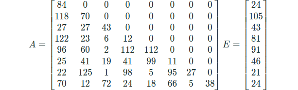

The above-specified sequence of commands leads us to the glass panel which gives us the information regarding the cryptanalysis technique used i.e EAEAE. The text specified that the input block is of 8 bytes as a vector over F128​ constructed using degree 7 irreducible polynomial x7 + x + 1 over F2​. It also specified 2 transformations :

- A : a linear transformation given by invertible 8 x 8 key matrix A with elements from F128​
- E : exponentiation given by 8 x 1 vector E whose elements are numbers between 1 and 126

Note : E is applied on a block by taking the ith element of the block and raising it to the power given by the ith element in E.

We tried many inputs and saw that the output only has some limited letters, i.e. from 'f' to 'u'. Then by observing each block of 2 letters, we concluded that the encryption is from 'ff' - 'mu' (this even has 128 characters).
Then we decided to keep inputs as follows :
"ffffffffffffffff", "ffffffffffffffgg", "ffffffffffffggff", and so on.
We observe that changing the ith byte of the input changes all the bytes of output after the ith byte. This implies that the ith byte is not used in computing the output values at byte number 0 to i - 1. From this, we concluded that the transformation matrix used here must be lower triangular.

After this we started to find the diagonal elements of matrix A and also vector E. For this we derived an equation which contains only ith diagonal element and ith element of vector E. The equation is yi = (aii ( aii . xiei ) ei ) ei​ . This equation is valid only if the ith byte of xi​ (input) is non zero and all other bytes are zero.

Now we used a fixed pair of input to calculate the possible values of ei​ and aii​. We choose xi1 = 1 and xi2 = 2. Now after taking the ratio of yi1 and yi2​ we get 2ei3. This gives 3 possible values of ei​ (since it is a cubic equation) and correspondingly we get 3 possible values of aii.

{ '24, 84', '75, 96', '28, 46'} 
{'105,70', '59,127', '90,9'} 
{'29,108', '43,43', '55,86'} 
{'15,68', '31,95', '81,12'} 
{'85,31', '78,5', '91,112'} 
{'96,71', '112,125', '46,11'} 
{'88,63', '18,123', '21,27'} 
{'28,33', '24,38', '75,53'} 
were the possible pairs respectively.

Now, it is not easy to find the right pair. For this we start to find the value of elements of the form ai,i-1. For finding this we selected 2 input pairs with value 1 and 2 at (i−1)th byte and rest byte as zero. Now the equation for finding ai,i-1​ will have dependency on ai ,i , ai-1,i-1 , ei​ and ei-1​. Now we choose a pair from the 3 possible values and try to find the value of ai,i-1. Now only the right combination gives the value of ai,i-1​. In this way we get the value of diagonal elements and the vector E along with ai,i-1.

Now finding the rest of elements was an easy task because we have all ai,i​ and ai,i-1 and vector E. We start finding in order ai,i-2 & ai,i-3​.... and so on. Again using the same method as of ai,i-1​ we found the value ofai,i-2​. And so on.

For the a7,0​ we get 3 possible values. And for all three values, we found the password and we got 3 values of password. We checked all three values of the password to get the right one.

The matrix A and vector E were found to be:

After calculating the inverse of matrix A i.e. A’ and the inverse of Exponential function E i.e. E’, the decryption becomes E’A’E’A’E’. Now we tried to decrypt the password using this decryption algorithm but it didn’t work. So we converted it into bits and used ASCII values, and then we got “xjtwcsnucg000000”. We removed extra zeros (as we thought 0’s were just for padding) from the end and it worked.  Thus the password we got is: xjtwcsnucg
